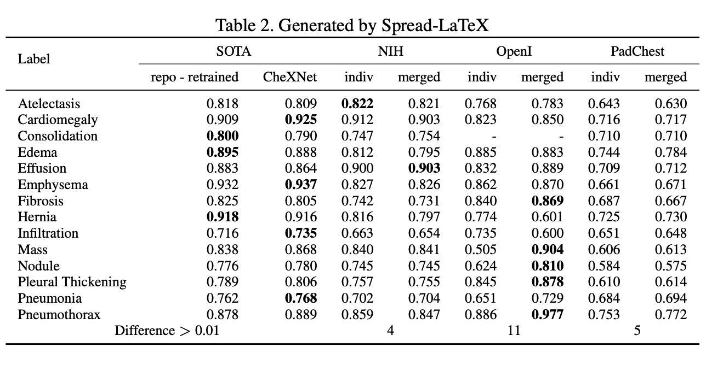
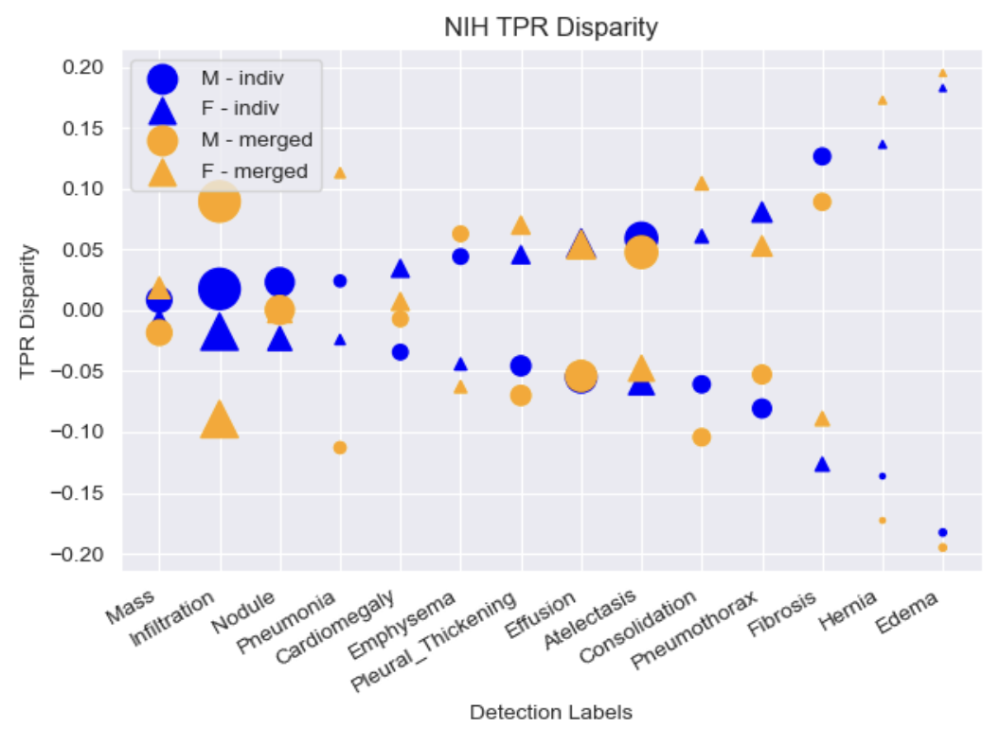
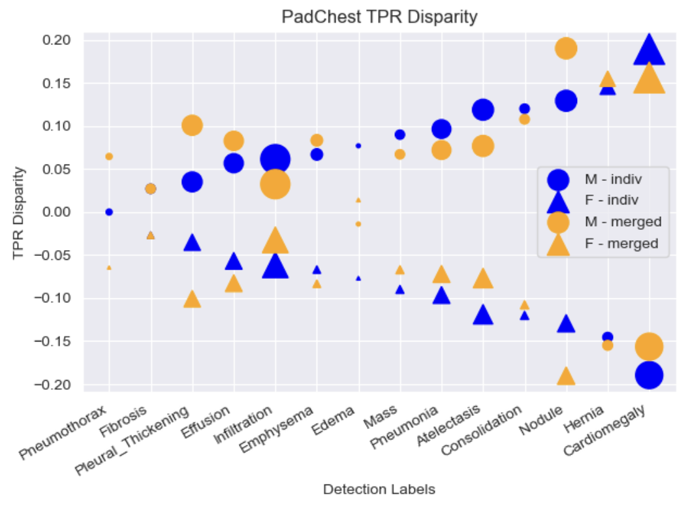

# xray-prediction-bias-eval: Group Bias Experiments for MultiClassification X-Ray Images

The goal in releasing this code is to provide an example project/use case for those interested in assessing group bias in models for non-tabular medical data. 

## Background
The majority of these scripts were adapted from the primary reference sources noted below and combined with processing scripts to generate the results presented in the *Investigation on Utility of Multi-source Datasets to Reduce Bias in Chest X-ray Classification* included in the repository. This was a few month project for a graduate-level class driven by the desire to obtain experience in both X-ray image classification and evalating model results based on identified protected groups. The results were visualized for True Positive Rate (TPR) disparity between records categorized by sex (M/F). Other fields such as age could also be evaluated for performance consistency.

## Results
A comparison of AUCs among the published CheXNet, updated reproduction, and models/datasets are provided in Table 2.


The NIH dataset is the reference set common to both SOTA models. Comparing the individual dataset AUCs for the NIH dataset, all but the following three categories fall within the range defined in Zech et al. : Edema, Fibrosis, and Hernia - two of which were the least represented labels in the training dataset. 

The AUC’s for OpenI on the merged model were the most improved when compared to the individual dataset. This might be attributed to the overall increase in the number of images available for training. 

It is notable that neither model performed greater than > 80% classification on any label in the PadChest dataset. This is particularly intriguing given that this dataset contains 28 different labels. It maybe that the pretrained architecture or selected hyperparmeters are not adequately capturing the dataset specific features. Perhaps customizing either or both would lead to a more effective classifier.

TPR disparity gaps between the patient’s record designated with ’M’ or ’F’ were calculated for individual datasets using the models trained on a single and the merged datasets. Only the NIH and PadChest datasets included the designations of interest. The TPR gaps are plotted together for comparison Figure 2 and 3. Points are scaled based on the category’s number of positive labels in the test set.




Results from other references suggested multi-source datasets as one mechanism to mitigate model bias. While this may be true for some specific labels and datasets, the results above indicate this is not universally true as there are well-represented classes that show greater disparity between selected subgroups when evaluated with the model trained on the merged dataset. The scaling of points highlights that for the NIH dataset disparity for Hernia and Edema may actually be attributed to the overall availability of positive labels than the model itself. 

## Extending Bias Evaluation
These results along with those from additional studies that have brought to light limitations on generalizing the chest X-ray task convey a breadth of research remaining in this area before developed models could be broadly used. One aspect open for further investigation is identifying limitations and application scopes for various publicly available datasets and models. Another area of consideration may be the understanding of the specific features in the images of subgroups to which the model has demonstrated bias.

## Script Execution Notes
These experiments were executed on university provided resources by parameterized requests for script execution. For that reason, only estimates on resource requirements can be provided. As a result of the shared resources, some modifications to package dependencies were required for those resources. The two primary areas of note that may be impacted are: 

- cuda version may impact: eval_threshold_xray.py line 78 - loading the model for evaluation 
- sklearn metrics version may alter: eval_threshold_xray.py line(s) 134 and 137 -  may require matrix or put to numpy
- version of pandas may make require modificaitons to the use of the append() method in eval and predictions

### Resource Requirements
- Storage for all data/image files being used
 - estimated total depends on source(s) -  1TB was adequate for datasources used
- GPU required for processing images
 - NVIDIA A100 80GB Tensor Core GPU used for initial work
- Executed on 1 node
- Same number of tasks/node as workers defined in scripts (8 in example scripts)
- Requested 50GB memory (RAM)

## Experiment Workflow
This section is intended to walk through the order scripts were leveraged to obtain results reported in report contained in this repository.

### Data Setup
- Data was selected to maximize category overlap
- .csv references for datasets were obtained from TorchXrayVision for split_referece_csv.py
 - if you want to obtain the image totals, the get_totals_script.py was used to print values in the logs
- split_reference_csv.py can be used to partition the data reference based on ratio selections

 **Note*: The Pytorch datasets from TorchXRayVision were extended to more closesly replicate the setup of data used in reproduce-chexnet. The extension made it possible to leverage the library as well as the existing training/eval scripts in other references. Both the single and merged TorchXRayVision datasets were extended.

### Analysis Sequence
The examples in this repo leverage the NIH dataset as a reference as it was also used in the reproduce-chexnet experiment
For each dataset:
- train model on individual data (example is retrain_xray_nih.py)
 - model should be dumped into a checkpoint directory with model name provided in retrain stage that calls M_xray.train_cnn()
- run predictions_test_xray_<dataset>.py
 - should provide results for determined prediction threshold, the raw values for the test set along with biprediction (0,1) based on threshold  
- run src/post_processing_scripts/tpr_determination.py with desired parameters to get tpr values for M/F categories
- run src/post_processing_scripts/tpr_density_plots_with_counts_<dataset>.py to recreate plots in paper

To train the model on merged data sets, the retrain_xray_merged.py would be used. The model name for the one trained on the merged data would then be used for the predictions and tpr_determination for each dataset.

## Acknowledgements and Citations
General acknowledgement for the contributions of researchers and developers at PyTorch, NIH, Stanford, and Project Jupyter. Their work serves as the foundation for this project.

Primary reference repositories:

```
@inproceedings{Cohen2022xrv,
title = {{TorchXRayVision: A library of chest X-ray datasets and models}},
author = {Cohen, Joseph Paul and Viviano, Joseph D. and Bertin, Paul and Morrison, Paul and Torabian, Parsa and Guarrera, Matteo and Lungren, Matthew P and Chaudhari, Akshay and Brooks, Rupert and Hashir, Mohammad and Bertrand, Hadrien},
booktitle = {Medical Imaging with Deep Learning},
url = {https://github.com/mlmed/torchxrayvision},
arxivId = {2111.00595},
year = {2022}
}
```

```
  title={CheXclusion: Fairness gaps in deep chest X-ray classifiers},  
  author={Seyyed-Kalantari, Laleh and Liu, Guanxiong and McDermott, Matthew and Chen, Irene and Marzyeh, Ghassemi},
  BOOKTITLE = {Pacific Symposium on Biocomputing},
  year={2021}
```

```@misc{Zech2018,
  author = {Zech, J.},
  title = {reproduce-chexnet},
  year = {2018},
  publisher = {GitHub},
  journal = {GitHub repository},
  howpublished = {\url{https://github.com/jrzech/reproduce-chexnet}}
}
```
